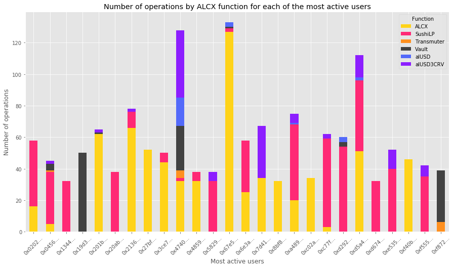
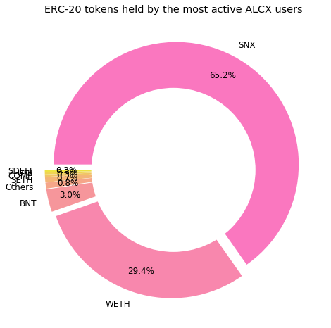

# Active ALCX Users

<a href='#i1'>1. Introduction</a><br>
<a href='#i2'>2. Alchemix functions used by the most active users</a><br>
<a href='#i3'>3. Operations of the most active users</a><br>
<a href='#i4'>4. ERC-20 portfolios of the most active users</a><br>
<a href='#i5'>5. Other protocols active users interact with</a><br>
<a href='#i6'>6. Determining and visualizing the different categories of active users</a><br>

<a id='i1'></a>
## 1. Introduction

The present piece is written to answer the following question: 
```
How do the most active Alchemix users differ?

Provide an analysis on whatever metrics you think are most interesting on the how the most active users in the past 30 days of the Transmuter, Alchemist/Vault, and 4 Farm Pools differ between each other.
Early investors make up roughly one third of all current ALCX holders:
```
We define the "most active Alchemix users" as users who have interacted at least once a day with one of the key functions of Alchemix over the past 30 days (as of April 17) as reported through <a href="https://api.flipsidecrypto.com/api/v2/queries/aec7cc0c-59a3-40cb-9dae-b2b563bbf8bc/data/latest">Flipside data</a>. This gives us a subset of 26 users. Active users are overall very few. Half of ALCX users have only executed one transaction with an Alchemix function over the past 30 days. The histogram of the frequency of transactions is given below:

<div align="center">
  
</div>

<a id='i2'></a>
## 2. Alchemix functions used by the most active users

The most active users predominantly engage with three of the four farming pools. 18 and 17 of the 26 most active users engage with the Sushi LP and ALCX farm respectively. 11 of the most active users have also engaged at least once with the alUSD3CRV pool over the past month.

<div align="center">
  
</div>

<a id='i3'></a>
## 3. Operations of the most active users

Unsurprisingly, most of the active users' operations are concentrated in the ALCX and Sushi-LP farms. There are, however, significant differences at the individual level.  Users engaging with the Vault and Transmuter, for instance, do not engage with the ALCX farm. The clearest differences are in terms of valuation, where users interacting with most of the USD value concentrated among users transacting with the Vault. Users in the ALCX farm, while very active, account for only very small valuations. 


<div align="center">
  
</div>

<div align="center">
   
</div>

<a id='i4'></a>
## 4. ERC-20 portfolios of the most active users

The ERC-20 holdings of the most active users are diversified but with most of the value concentrated in a few DeFi tokens held by the wealthiest users. There are significant differences both in terms of the tokens held and the USD value of the portfolios.


<div align="center">
  
</div>

<div align="center">
   
</div>

<a id='i5'></a>
## 5. Other protocols active users interact with


While the Alchemix Staking Pools and other Alchemix functions are the main addresses that active users interact with, they also interact with a number of other DeFi protocols. The top 20 are given in the chart below, with Sushiswap (`router`), Uniswap and 0x (`exchange proxy`) some of the most popular:

<div align="center">
   
</div>


<a id='i6'></a>
## 6. Determining and visualizing the different categories of active users


To better grasp the different categories of active users, I vectorized each of the active users with different features, starting with the number of operations executed in each of Alchemix's function. I then performed dimensionality reduction using principal component analysis. Finally, I used a clustering algorithm to group together users that exhibited similar behavior in their use of Alchemix functions. Plotting the cluster in 2 dimensions (the first 2 principal components) gives us the following graph:

<div align="center">
   
</div>

We have 3 different clusters here. and a quick look at the components shows that the number of transactions in the Vault was the main contributor to the component 1 and the number of transaction in the ALCX pool the main contributor for component 2. This can help us understand how the active users are grouped together and separated.

If we map back the addresses on the graph to our data, we notice that the two addresses in the lower right corner are users very active in the Vault. Active users in pink in the lower left corner are users that are not very active in the ALCX pools. And users in the upper left corner are very active in the ALCX pools. This is of course a simplification, and other factors influence the categorization of the users.

I attempted to increase the number of features by adding the interactions with addresses outside of Alchemix's functionality, but this turned a couple of users into outliers and biased the clustering process. It would however be interesting to attempt to use the same technique with a larger set of both users and features.
