# Early and Late ALCX Investors

<a href='#i1'>1. Introduction</a> 
<a href='#i2'>2. Investor portfolios</a> 
&emsp;<a href='#i21'>2.1. ERC-20 tokens distribution</a> 
&emsp;<a href='#i22'>2.2. ERC-20 tokens by value held</a> 
&emsp;<a href='#i23'>2.3. ERC-20 tokens by number of holders</a> 
<a href='#i3'>3. Investor staking behavior</a> 

## 1. Introduction

Are there any differences between early and late ALCX investors? The present piece investigates this question by looking at the portfolios of ERC-20 tokens and the staking behaviors of two sets of ALCX investors. We define early investors as any user having purchased ALCX tokens during the first week after the project's launch (from February 27th to March 3rd). Late investors are defined as anybody having purchased ALCX tokens for the first time after March 3rd. The portfolio data for each group was obtained through <a href='https://api.flipsidecrypto.com/api/v2/queries/ee39f2d3-f0c8-4c78-96c0-fd0270f40011/data/latest'>Flipside</a> based on a snapshot of users' wallet on April 16th.

Early investors make up roughly one third of all current ALCX holders:

  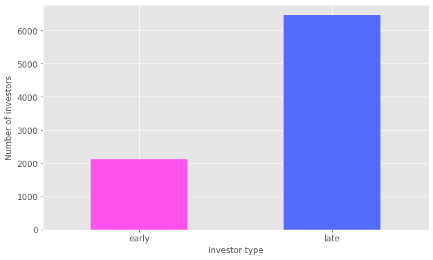

While late investors collectively hold over a billion dollar worth of ERC-20 tokens compared to early investor's 280+ millions, that difference is proportional to the number of investors making up each group. The average portfolio value for early investors is $137,650 against $161,819 for late investors:

  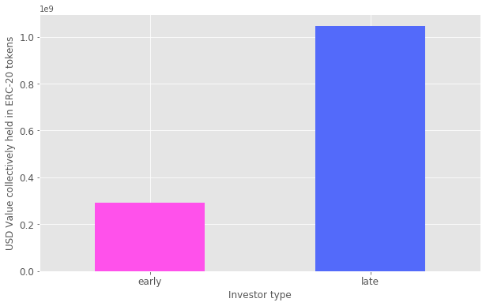

## 2. Investor portfolios

Looking at the aggregate portfolios of the two investor groups reveals some notable differences. In both portfolios, WETH accounts for most of the value and blue chip DeFi tokens such as SNX or AAVE account for the majority of tokens. However, while WBTC is the second largest hold in value for late investors, it is only a minor hold for early investors. Likewise the proportion of value held in stablecoins is much higher in the late investors portfolio suggesting that this group is more risk averse than early investors. 

Alchemix is built upon Yearn and while a higher proportion of early investors held the token compared to late investors, YFI holds a much more significant position in terms of value in the late investors' portfolio. This suggests that the arrival of a few YFI-rich investors among the group of late investors. 

The late investors' group has more ALCX holders than the early investors group. This indicates that early investors are probably more likely to stake their ALCX for extra rewards, while late investors may not all be aware of the extra mining incentives. The issue of staking is explored in further detail in the next section.

### 2.1. ERC-20 tokens distribution

  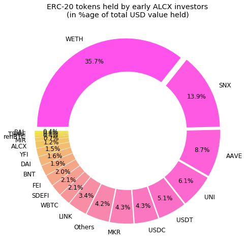
  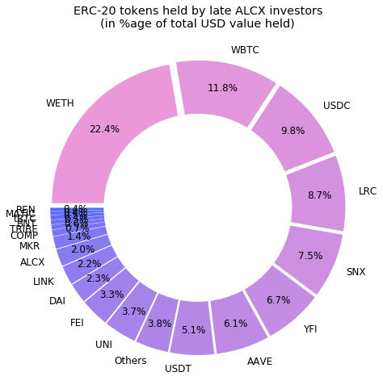

### 2.2. ERC-20 tokens by value held

  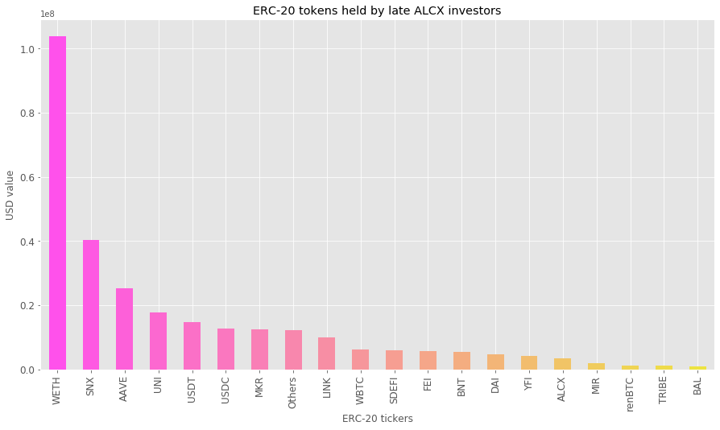

  

### 2.3. ERC-20 tokens by number of holders

  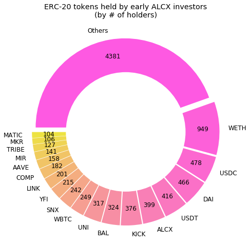
  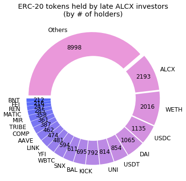

## 3. Investor staking behavior

There are significant differences in the staking behavior of early and late investors. As can be seen in the graph below, early investors account for most of the total value locked across all of Alchemix's functions: 

  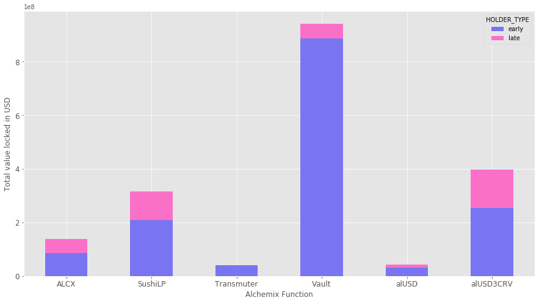

When comparing the way assets are staked across Alchemix's functions also shows an apparent difference:

  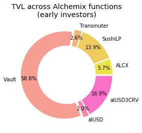 
  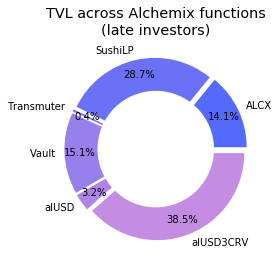

However, the distribution is skewed by the Vault, where a few early users account for over 75% of the TVL. If we only consider the distribution of TVL across the 4 ALCX farms, we find that there are few actual differences between early and late investors:

  
  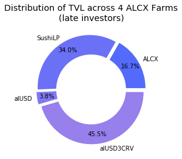

