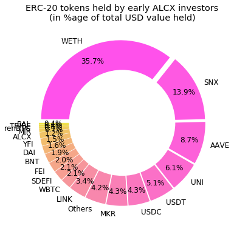
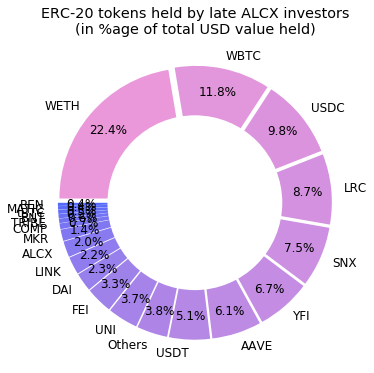
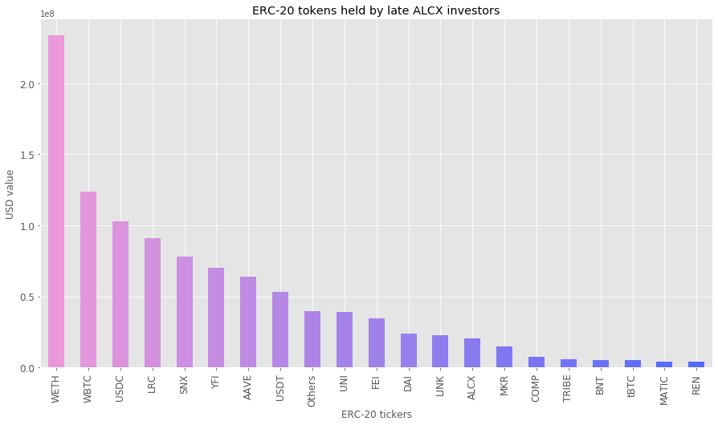
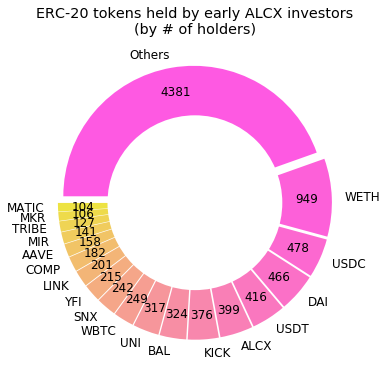
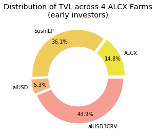
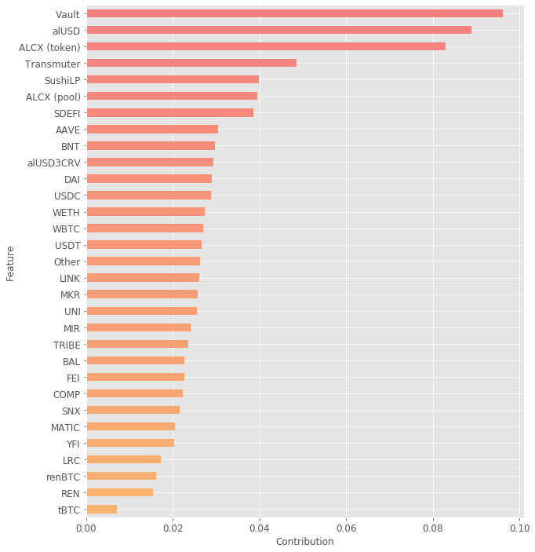

# Early and Late ALCX Investors

<a href='#i1'>1. Introduction</a> 
<a href='#i2'>2. Investor portfolios</a> 
&emsp;<a href='#i21'>2.1. ERC-20 tokens distribution</a> 
&emsp;<a href='#i22'>2.2. ERC-20 tokens by value held</a> 
&emsp;<a href='#i23'>2.3. ERC-20 tokens by number of holders</a> 
<a href='#i3'>3. Investor staking behavior</a> 
<a href='#i4'>4. Using marchine learning to map differences between investor groups</a> 

## 1. Introduction

Are there any differences between early and late ALCX investors? The present piece investigates this question by looking at the portfolios of ERC-20 tokens and the staking behaviors of two sets of ALCX investors. We define early investors as any user having purchased ALCX tokens during the first week after the project's launch (from February 27th to March 3rd). Late investors are defined as anybody having purchased ALCX tokens for the first time after March 3rd. The portfolio data for each group was obtained through <a href='https://api.flipsidecrypto.com/api/v2/queries/ee39f2d3-f0c8-4c78-96c0-fd0270f40011/data/latest'>Flipside</a> based on a snapshot of users' wallet on April 16th.

Early investors make up roughly one third of all current ALCX holders:

  

While late investors collectively hold over a billion dollar worth of ERC-20 tokens compared to early investor's 280+ millions, that difference is proportional to the number of investors making up each group. The average portfolio value for early investors is $137,650 against $161,819 for late investors. However the median ERC-20 portfolio value for early investors is $2,764 against $1,194 for late investors. This discrepancy between the mean and the median means that there is more inequality among late investors (more - or larger - whales and smaller portfolio values for regular users).

  

## 2. Investor portfolios

Looking at the aggregate portfolios of the two investor groups reveals some differences - however most are the results of ALCX entering contracts with large holdings of other tokens. In both portfolios, WETH accounts for most of the value and blue chip DeFi tokens such as SNX or AAVE account for the majority of tokens. 

While WBTC is the second largest hold in value for late investors, it is only a minor hold for early investors. However, almost the entirety of WBTC value is held by a single address hosting the <a href='https://etherscan.io/address/0x40ec5b33f54e0e8a33a975908c5ba1c14e5bbbdf#code'>Matic Bridge contract</a> and is simply an indication of user migration to Matic. Likewise the proportion of value held in stablecoins is much higher in the late investors portfolio suggesting that this group is more risk averse than early investors. 

Alchemix is built upon Yearn and while a higher proportion of early investors held the token compared to late investors, YFI holds a much more significant position in terms of value in the late investors' portfolio. However, rather than an actual difference in holding patterns, this is largely a reflection of the large amount of YFI held by the <a href="https://etherscan.io/address/0xb1cff81b9305166ff1efc49a129ad2afcd7bcf19#code">Yearn vault</a>. 

The late investors' group has more ALCX holders than the early investors group. This indicates that early investors are probably more likely to stake their ALCX for extra rewards, while late investors may not all be aware of the extra mining incentives. The question of staking is explored in further detail in the next section.

### 2.1. ERC-20 tokens distribution

  
  

### 2.2. ERC-20 tokens by value held

  

  

### 2.3. ERC-20 tokens by number of holders

  
  

## 3. Investor staking behavior

There are significant differences in the staking behavior of early and late investors. As can be seen in the graph below, early investors account for most of the total value locked across all of Alchemix's functions: 

  

Comparing the way assets are staked across Alchemix's functions also shows an apparent difference:

   
  

However, the distribution is skewed by the Vault, where a few early users account for over 75% of the TVL and several hundred millions USD. If we only consider the distribution of TVL across the 4 ALCX farms, we find that there are few actual differences between early and late investors:

  
  

## 4. Using marchine learning to map differences between investor groups

To get a more quantified understanding of how much the two groups differ and how each of the specific differences previously noted contribute to inter-group differenciation, I train a simple machine learning classifier to distinguish between early and late investors.

Each investor in the dataset was vectorized according to a set of 31 features: TVL in each of Alchemix's function (6 feature), USD balance for 24 ERC-20 tokens most commonly held by ALCX user (24 features) and USD balance for all other ERC-20 token in their portfolio. The data is normalized an an XGBoost classifier is trained on it with class weighting to account for the imbalance between early and late users. Without any further preprocessing and hyperparmeter optimization, the model's F-1 score was 0.68 which is not great but better than chance and therefore suggests that there are indeed meaningful differences between the two groups.

The importance given to each feature by the model is charted below:

  

It appears that the portfolio constitution is not a very good predictor of the difference. This may be due to the fact that the dataset only considers ERC-20 assets held but ignores assets staked in pools outside of Alchemix. TVL in the pools, on the other hand, is the best indicator of whether a user is an early or late investor. The role of the Vault may be overplayed by outliers. Whether investors hold the ALCX token - rather than stake it - also plays a significant role in discriminating between the two groups. 
