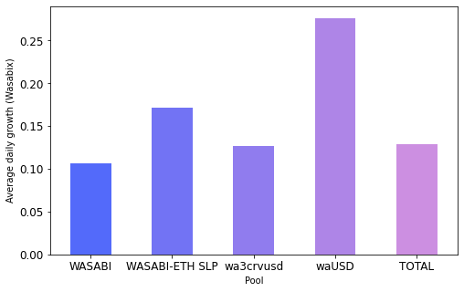

# Comparison of ALCX and one of its forks

<a href='#i1'>1. Introduction</a> 
<a href='#i2'>2. Historical TVL in the two protocols</a> 
<a href='#i3'>3. Average TVL daily growth of the two protocols</a> 

## 1. Introduction

Wasabix is a fork of Alchemix that launched at the end of March. The main differences between Wasabix and Alchemix were summed up by Alchemix's co-founder in the following way:

  

In spite of this, the protocol has gained traction and now holds 80 millions dollars in TVL (30+ millions of which are in the main 4 pools analyzed here: waUSD, wa3CRV, WASABI, WASABI-WETH). The present piece aims at answering the question `What is the farming volume on the Wasabix Fork compared to Alchemix?`. Data for the <a href="https://app.flipsidecrypto.com/shareable/alchemix-historical-tvl-mTHdp6">Alchemix</a> and <a href="https://api.flipsidecrypto.com/api/v2/queries/dc53af5a-a5c0-4a89-b883-bc762ed796ee/data/latest">Wasabix</a> pools was obtained from Flipside.

## 2. Historical TVL in the two protocols

The evolution of the TVL in both protocols since their launch is given below:

  

  

Both protocols have grown quickly since their inception. 28 days after its launch, Wasabix holds $31,703,200 in TVL. At the same point, Alchemix held $573,579,002.

## 3. Average TVL daily growth of the two protocols

The two protocols have grown at different rates. Although Wasabix is an order of magnitude smaller in terms of TVL compared to Alchemix, the protocol has actually grown faster. On the day of its launch, Wasabix only held $351,348 in TVL against $31,703,200 28 days later - or a 8923.29% increase. On the other hand, Alchemix started with $16,821,176 on its first day, reaching $573,579,002 after 28 days (+3309%) and $889,531,740 today (+5188.17%). In the two charts below, I look at the daily average growth rate of each of the pools over the first 28 days period - after having removed the first two days as outliers:

  

  

There are several differences in the average growth rates of individual pools but overall Wasabix has grown at a faster pace than Alchemix. This can be explained in different ways : Alchemix was as a much anticipated project and so enjoyed a large influx of liquidity almost as soon as it launched. On the other Wasabix was a fork that started with very little liquidity and therefore had more room to grow day-by-day. That growth, however, would likely have been impossible without the success of the original Alchemix project, thus highlighting the unfair advantage of forks that can achieve growth rates superior to that of the original product.
