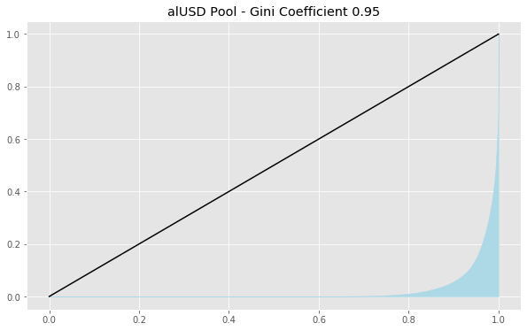
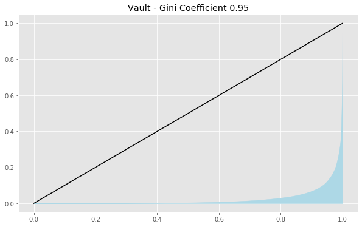
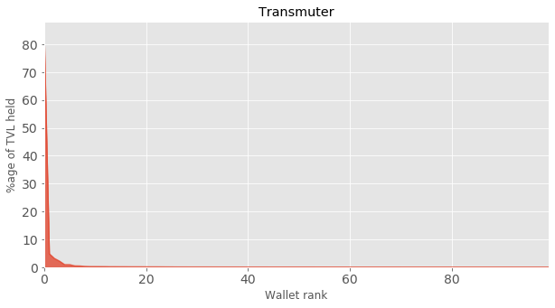

# ALCX Large Holder Impact


## 1. Introduction

This piece is written to answer the following questions regarding the Alchemix ecosystem.

```
- What is the percent of each of the Transmuter (0xab7a49b971afdc7ee26255038c82b4006d122086), Alchemist/Vault (0xc21d353ff4ee73c572425697f4f5aad2109fe35b), and 4 Farm Pools (0xab8e74017a8cc7c15ffccd726603790d26d7deca) are controlled by the top 25 addresses by volume?
- What is the GINI index for each top 25 addresses by volume? How has this changed over time (by day)?
```

The data was obtained from <a href="https://app.flipsidecrypto.com/shareable/alcx-whales-in-pools-fVKsea">Flipside</a> and processed with Python.

## 2. ALCX Pool

In the ALCX Pool (<a href="https://etherscan.io/address/0xdBdb4d16EdA451D0503b854CF79D55697F90c8DF">0xdBdb4d16EdA451D0503b854CF79D55697F90c8DF</a>), the top 25 wallets hold 40.1% of the value or 32330.51 ALCX (~56 125 765 USD at 2021/04/13 value).

The percentage of the pool held by the top 100 wallets is charted below:

<div align="center">
  
</div>

The GINI coefficient for the pool was 0.91, the distribution of wealth is charted as a Lorenz curve below:

<div align="center">
  
</div>


## 3. Sushi LP

In the Sushi Pool (<a href="https://etherscan.io/address/0xC3f279090a47e80990Fe3a9c30d24Cb117EF91a8">0xC3f279090a47e80990Fe3a9c30d24Cb117EF91a8</a>), the top 25 wallets hold 43.9% of the value or 52016.66 SLP (~126 584 193 USD at 2021/04/13 value).

The percentage of the pool held by the top 100 wallets is charted below:

<div align="center">
  
</div>

The GINI coefficient for the pool was 0.89, the distribution of wealth is charted as a Lorenz curve below:

<div align="center">
  
</div>


## 4. alUSD Pool

In the alUSD Pool (<a href="https://etherscan.io/address/0xBC6DA0FE9aD5f3b0d58160288917AA56653660E9">0xBC6DA0FE9aD5f3b0d58160288917AA56653660E9</a>), the top 25 wallets hold 64.7% of the value or ~32 396 744 USD.

The percentage of the pool held by the top 100 wallets is charted below:

<div align="center">
  
</div>

The GINI coefficient for the pool was 0.95, the distribution of wealth is charted as a Lorenz curve below:

<div align="center">
  
</div>


## 5. alUSDCRV Pool

In the alUSDCRV Pool (<a href="https://etherscan.io/address/0x43b4FdFD4Ff969587185cDB6f0BD875c5Fc83f8c">0x43b4FdFD4Ff969587185cDB6f0BD875c5Fc83f8c</a>), the top 25 wallets hold 56.6% of the value or or ~214 179 630 USD.

The percentage of the pool held by the top 100 wallets is charted below:

<div align="center">
  
</div>

The GINI coefficient for the pool was 0.92, the distribution of wealth is charted as a Lorenz curve below:

<div align="center">
  
</div>


## 6. Vault

In the ALCX Pool (<a href="https://etherscan.io/address/0xc21D353FF4ee73C572425697f4F5aaD2109fe35b">0xc21D353FF4ee73C572425697f4F5aaD2109fe35b</a>), the top 25 wallets hold 72.2% of the value or ~681 258 234 USD.

The percentage of the pool held by the top 100 wallets is charted below:

<div align="center">
  
</div>

The GINI coefficient for the pool was 0.95, the distribution of wealth is charted as a Lorenz curve below:

<div align="center">
  
</div>


## 7. Transmuter

In the ALCX Pool (<a href="https://etherscan.io/address/0xdBdb4d16EdA451D0503b854CF79D55697F90c8DF">0xdBdb4d16EdA451D0503b854CF79D55697F90c8DF</a>), the top 25 wallets hold 98.8% of the value or ~11 051 949 USD.

The percentage of the pool held by the top 100 wallets is charted below:

<div align="center">
  
</div>

The GINI coefficient for the pool was 0.97, the distribution of wealth is charted as a Lorenz curve below:

<div align="center">
  
</div>
