# Twitter discourse and Alchemix metrics

<a href="#i1">1. Introduction</a> 
&emsp;<a href="#i11">1.1. Dataset overview  </a> 
&emsp;&emsp;<a href="#i111">1.1.1. Linguistic distribution of the tweets  </a> 
&emsp;&emsp;<a href="#i112">1.1.2. Mentions, hashtags & tickers  </a> 
<a href="#i2">2. Keywords and themes  </a> 
&emsp;<a href="#i21">2.1. Wordcloud  </a> 
&emsp;<a href="#i22">2.2. Topics  </a> 
<a href="#i3">3. Twitter discourse and ALCX metrics  </a> 
&emsp;<a href="#i31">3.1. Correlation between volume of discourse and price  </a> 
&emsp;<a href="#i32">3.2. Other metrics </a> 
&emsp;&emsp;<a href="#i321">3.2.1. Total value locked (TVL) </a> 
&emsp;&emsp;<a href="#i322">3.2.2. Unique wallets </a> 
&emsp;<a href="#i33">3.3. Impactful individual tweets  </a> 
<a href="#i4">4. Sentiment analysis  </a> 
&emsp;<a href="#i41">4.1. General sentiment  </a>   
&emsp;&emsp;<a href="#i411">4.1.1. Bullish tweets  </a> 
&emsp;&emsp;<a href="#i412">4.1.2. Bearish tweets  </a> 
&emsp;<a href="#i42">4.2 Twitter sentiment and price  </a> 

 
## 1. Introduction

An increasing body of evidence has highlighted the relationship between Twitter and financial markets, including cryptomarkets. This paper will look at the relationship between discourse about Alchemix on Twitter and the asset's price. 

The hourly price data was obtained through <a href="https://app.flipsidecrypto.com/shareable/alcx-hourly-prices-fG2xmn">Flipside</a>

The Twitter dataset used covers the period between February 26th, 2021 and April 9th, 2021. It contains all tweets returned by Twitter for a full text or hashtag search over the following terms: `Alchemix`, `AlchemixFi` and `ALCX`.

The code for this piece is available as a Jupyter notebook <a href="#">here</a>.

### 1.1. Dataset overview

The dataset comprises 10 882 tweets, or about 250 tweets per day for the period. By comparison, $BTC <a href="https://www.theblockcrypto.com/linked/95474/weekly-bitcoin-tweet-volume-hit-a-new-high-this-month">reached close to 100 000 tweets per day</a> in February and $ETH has gathered over 20 000 tweets per week since January. 

A quick look at the data revealed a non-trivial amount (~250 or slightly over 2% of the dataset) of scam tweets offering an Alchemix airdrop, followed by complaints of users who got scammed. I opted to leave the tweets in the dataset nonetheless.

#### 1.1.1. Linguistic distribution of the tweets

A sizeable portion of the tweets were in languages other than English. Applying language detection to the dataset shows that 80% of the tweets are in English and the remaining 20% spread accross other languages such as German, Portuguese, Spanish and Japanese, suggesting that there might be potential for growth in adopting a more global outreach strategy. The full linguistic distribution is given below:

  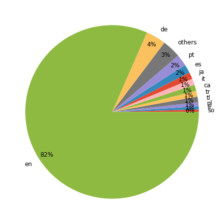

#### 1.1.2. Mentions, hashtags & tickers

We can also look at the hashtags and tickers most commonly used to see what projects are discussed in relation to Alchemix. I'll also extract the mentions to see what Twitter accounts are most often interpellated by people discussing the project.
Unsurprisingly, the projects that the Alchemix protocol relies on ($ETH, $SUSHI, $YFI, $DAI, $ALUSD) are all well represented as are other DeFi projects ($INV, $RUNE, $RGT).

  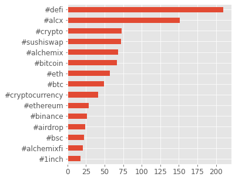
  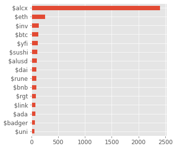
  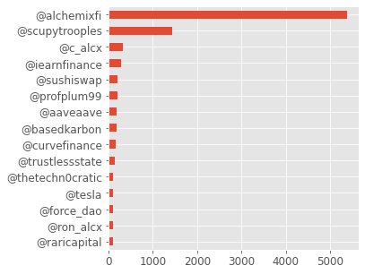

## 2. Keywords and themes

What do Twitter users talk about when they talk about Alchemix? 

### 2.1. Wordcloud

A word cloud can offer a quick, visual answer to this question. To generate one, I apply some basic preprocessing to the dataset (lemmatization, removal of stopwords including those used to as search terms on Twitter). The result shows that there are clearly more people talking about buying than selling:

  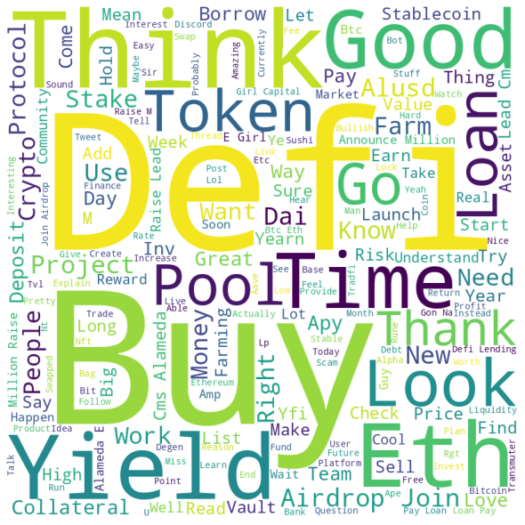

### 2.2. Topics

For a more detailed picture, topic modelling can give us a thematic overview by generating groups of related keywords. Running it and selecting for the number of topics iteratively gives the following result:

<table>
  <tr>
    <td>
      Topic 0
    </td>
    <td>
      alcx, buy, eth, sushiswap, swapped, inv, stake, pool, referral, farm, go, sushi, ape, price, list
    </td>
  </tr>
  
  <tr>
    <td>
      Topic 1
    </td>
    <td>
      alchemix, raise, alameda, cms, lead, million, capital, announce, girl, defi, lending, bitcoin, back, protocol, income
    </td>
  </tr>
  
  <tr>
    <td>
      Topic 2
    </td>
    <td>
      loan, pay, yield, dai, alusd, like, alchemix, defi, deposit, collateral, think, good, use, look, borrow
    </td>
  </tr>
  
  <tr>
    <td>
      Topic 3
    </td>
    <td>
      airdrop, join, alchemix, defiqa, sfm, kjb, pluto, referral, link, telegram, coins, coin, task, claim, wallet
    </td>
  </tr>
</table>
   
Topic 0 looks like it is about trading and farming, Topic 1 about Investors and seed rounds, Topic 2 about the Alchemix protocol/product itself and Topic 3 about airdrops - both legit (ForceDAO) and scammy. The proportions of the overall discourse on Twitter that each of these topics account for is given in the chart below:

  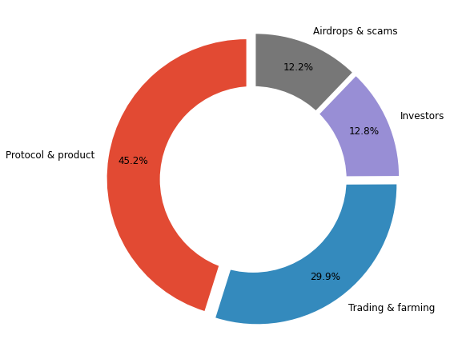

## 3. Twitter discourse and ALCX metrics

### 3.1. Correlation between volume of discourse and price

What is the relationship between the volume of discourse on Twitter and the price of ALCX? The two metrics are plotted in the graph below:

  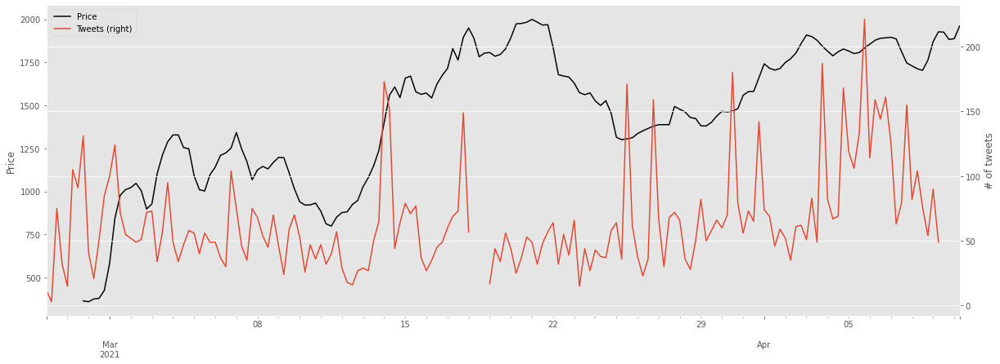

The two series are positively correlated (Pearson's R = 0.22, p = 0.00433) suggesting that changes in Twitter discourse volume influences Alchemix price and/or vice-versa. Running a <a href="https://en.wikipedia.org/wiki/Granger_causality">Granger causality test</a> will let us know if one (or both) of the two variables has predictive power for the other. Granger tests also let us specify lags to account for the fact that the effect of one variable of the other may be delayed in time. I used 6 hour intervals and 5 lags. 

While there is no evidence that Twitter discourse influences price, **price fluctuations do have a significant effect on discourse volume** at lags 1 and 2. This suggests that Alchemix Twitter users are more reactive than proactive - discussing price variations rather than causing them.

### 3.2. Other metrics

Let's look at other metrics beyond price: total value locked in farming pools and new unique wallets. The periodicity will be daily.

#### 3.2.1. Total value locked (TVL)

For total value locked, there was no significant evidence of correlation:

  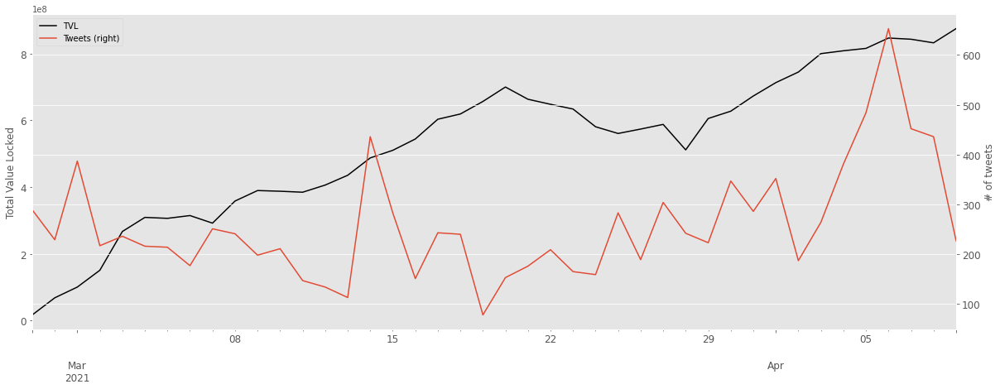

#### 3.2.2. Unique wallets

For the number of daily new wallets, there was likewise no significant evidence of correlation:

  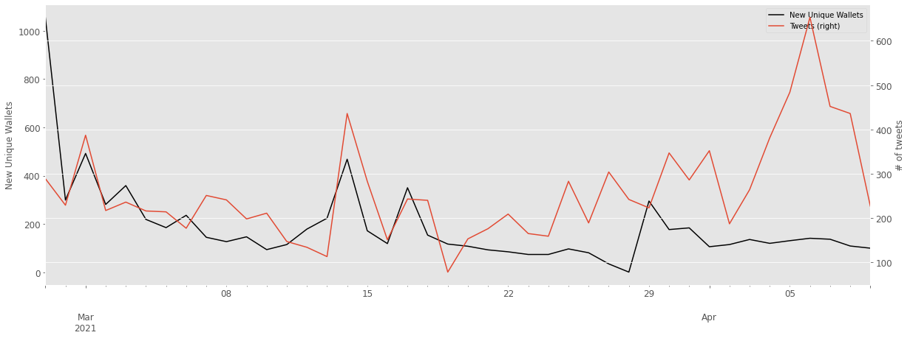

### 3.3. Impactful individual tweets

While overall the volume of discourse on Twitter seems unable to influence the price of Alchemix, it is possible that individual tweets could move the price. Elon Musk's tweet about $BTC and $DOGE, for instance, have caused <a href="https://www.forbes.com/sites/ronshevlin/2021/02/21/how-elon-musk-moves-the-price-of-bitcoin-with-his-twitter-activity/?sh=385d85c45d27">variations of over 20%</a> in the price of each asset. 

It is easier, however, to evaluate the impact of a known tweet on an asset's price or volume than it is to figure out what specific tweet could have cause a price variation from a large dataset of undifferentiated tweets. The task is made harder by the fact that I did not include metadata such as follower count in the dataset. To nonetheless give this a try, I calculated the price variations over 6 hour intervals for the entire period considered. I then took the largest variations and looked at the tweets posted in the previous hour.

For the biggest positive price variation (+7.25% over 6 hours), the tweets were as follow:

<table border="1" class="dataframe">
  <thead>
    <tr style="text-align: right;">
      <th></th>
      <th>content</th>
      <th>user</th>
    </tr>
  </thead>
  <tbody>
    <tr>
      <th>4244</th>
      <td>@defichadventure @AlchemixFi True chads</td>
      <td>thelionshire</td>
    </tr>
    <tr>
      <th>4245</th>
      <td>@defichadventure @AlchemixFi wow what a bunch of nerds</td>
      <td>TheCryptoDog</td>
    </tr>
    <tr>
      <th>4246</th>
      <td>@defichadventure @AlchemixFi lmao this is fucking beautiful</td>
      <td>transmissions11</td>
    </tr>
    <tr>
      <th>4247</th>
      <td>@defichadventure @AlchemixFi certified chads up in there</td>
      <td>thetechn0cratic</td>
    </tr>
    <tr>
      <th>4248</th>
      <td>@AlchemixFi  and the pseudo anonymous team doing the lords work. Making money make sense for the first time in human history!!!</td>
      <td>theDESK9</td>
    </tr>
    <tr>
      <th>4249</th>
      <td>@JKrantz @Substreight @AlchemixFi @Tesla It's over collateralized (2x), but also pays itself using interest from yearn dai vault currently.</td>
      <td>bitcoin4bernie</td>
    </tr>
    <tr>
      <th>4250</th>
      <td>@defichadventure @AlchemixFi</td>
      <td>J1998Madden</td>
    </tr>
    <tr>
      <th>4251</th>
      <td>@PrestonPysh @BlockFiZac @elonmusk @AlchemixFi is already doing this</td>
      <td>FinancePursuits</td>
    </tr>
    <tr>
      <th>8529</th>
      <td>few\n$alcx $wasabi</td>
      <td>BlueSaunaRobe</td>
    </tr>
  </tbody>
</table>

Most of these tweets actually belong to a <a href="https://twitter.com/defichadventure/status/1374782668915814401">single thread</a> by `@defichadventure` about "big brain community members" discussing the maths behind Uniswap v3 on Alchemix's `#off-topic` Discord channel:

  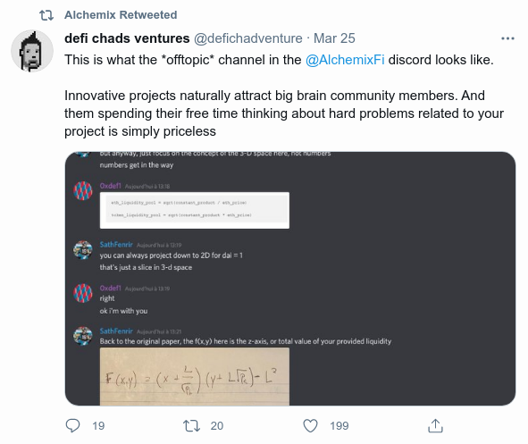

So maybe the quality of the community worked as a strong buy signal.

The exercise proves less meaningful when considering large drops in price as those large negative variations were are artefacts of early volatility and concentrated during the first days of the project.

## 4. Sentiment analysis

Despite extensive research and efforts, Twitter sentiment analysis is still far from being unreliable. The accuracy of state-of-the-art models <a href="https://dl.acm.org/doi/pdf/10.1145/3185045">hovers around 70 percent</a>. Consequently conclusions drawn from sentiment analysis ought to be taken with a grain of salt.

I used a <a href="https://paperswithcode.com/method/roberta">RoBERTa</a> based <a href="https://huggingface.co/cardiffnlp/twitter-roberta-base-sentiment">model trained on Twitter data for sentiment analysis.</a> I only applied minor preprocessing (removing mentions and the hash key in front of hashtags) and slightly transformed the original model's ouput to obtain a final score between -1 (negative) and 1 (positive) for each Tweet.

### 4.1. General sentiment

The average sentiment score over the dataset was 0.15, indicating an overall positive outlook. The distribution of the scores shows that most of the tweets are actually neutral, concentrated in the [-0.25;0.25] interval, with few overly negative tweets and a large number of very positive tweets:

  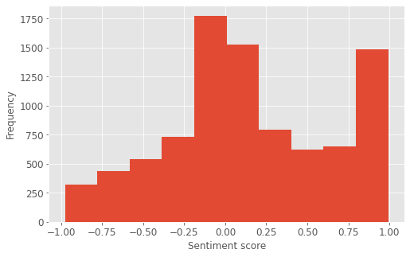

#### 4.1.1. Bullish tweets

The most positive tweets were as follows:

<table border="1" class="dataframe">
  <thead>
    <tr style="text-align: right;">
      <th></th>
      <th>content</th>
      <th>score</th>
    </tr>
  </thead>
  <tbody>
    <tr>
      <th>8868</th>
      <td>Very happy about my entry in Alchemix of 2 days ago, already up 20% and on top of that gaining huge interests by stacking them. Let's go! 🔥🚀🚀🚀\n</td>
      <td>0.991038</td>
    </tr>
    <tr>
      <th>8869</th>
      <td>Will be my first time using the app. Excited!</td>
      <td>0.991294</td>
    </tr>
    <tr>
      <th>8870</th>
      <td>This is such a great project. HYPED ALCX</td>
      <td>0.991304</td>
    </tr>
    <tr>
      <th>8871</th>
      <td>Great project, bright future. Congrats to the team. Excited to see whats to come.\n\n  ALCX</td>
      <td>0.991313</td>
    </tr>
    <tr>
      <th>8872</th>
      <td>Very exciting times. Really enjoying what this team is putting together and looking forward to what is next.   👏</td>
      <td>0.991383</td>
    </tr>
    <tr>
      <th>8873</th>
      <td>awesome to see ALCX doing so well. congrats scoop!!!</td>
      <td>0.991444</td>
    </tr>
    <tr>
      <th>8874</th>
      <td>Love the aesthetic of  its so beautiful I am excited to use the interface!</td>
      <td>0.991502</td>
    </tr>
    <tr>
      <th>8875</th>
      <td>That's amazing! Loving these new "advance forward time" tokens. ALCX is pretty cool too</td>
      <td>0.991535</td>
    </tr>
    <tr>
      <th>8876</th>
      <td>Look at this beauty.... The app is insanely easy to use/interact with. Very excited about this one brahs!\n\nALCX</td>
      <td>0.991919</td>
    </tr>
    <tr>
      <th>8877</th>
      <td>Super excited about your project! Have been in it for about a week and everything is running smoothly. Couldn't be more happy. Nice UI too. Keep up the good work!</td>
      <td>0.992044</td>
    </tr>
  </tbody>
</table>

#### 4.1.2. Bearish tweets

The most negative tweets were as follow:

<table border="1" class="dataframe">
  <thead>
    <tr style="text-align: right;">
      <th></th>
      <th>content</th>
      <th>score</th>
    </tr>
  </thead>
  <tbody>
    <tr>
      <th>0</th>
      <td>I waste my time for that... fuck</td>
      <td>-0.975216</td>
    </tr>
    <tr>
      <th>1</th>
      <td>i hate you</td>
      <td>-0.973709</td>
    </tr>
    <tr>
      <th>2</th>
      <td>Damn you shit heads are rude</td>
      <td>-0.971691</td>
    </tr>
    <tr>
      <th>3</th>
      <td>Yo ALCX I just bought this fucking GARBAGE today when the FUCK is that BAG getting dropped off!?  ETH cryptocurrency TiredoftheBullshit</td>
      <td>-0.971330</td>
    </tr>
    <tr>
      <th>4</th>
      <td>wow you guys really don't understand alchemix and i would expect more from y'all</td>
      <td>-0.966307</td>
    </tr>
    <tr>
      <th>5</th>
      <td>thats a fucking SCAM, idiot. \n\nALCHEMIX HAVE NO AIRDROP!!!</td>
      <td>-0.966076</td>
    </tr>
    <tr>
      <th>6</th>
      <td>Because of that horrible Curve website I partially missed the first DeFi wave. \n\nI kept going back to that website and thinking who on earth wants to use this!?\n\nI still wouldn't dare to navigate through that website with my funds.</td>
      <td>-0.961155</td>
    </tr>
    <tr>
      <th>7</th>
      <td>my ALCX position if flipping between +500 and -500\nNot gonna fucking make it as I'll die from a heart attack.</td>
      <td>-0.956623</td>
    </tr>
    <tr>
      <th>8</th>
      <td>AUTO is undervalued as fuck</td>
      <td>-0.956382</td>
    </tr>
    <tr>
      <th>9</th>
      <td>I'd probs be very annoyed by them IRL\n\nalso grossed out by them shedding their skin</td>
      <td>-0.956151</td>
    </tr>
  </tbody>
</table>

### 4.2 Twitter sentiment and price

The variations of $ALCX price and averaged Twitter sentiment over 6 hour periods are charted below. However there was no significant evidence of any correlation between the two series: 

  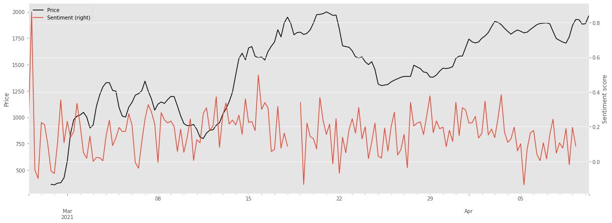

