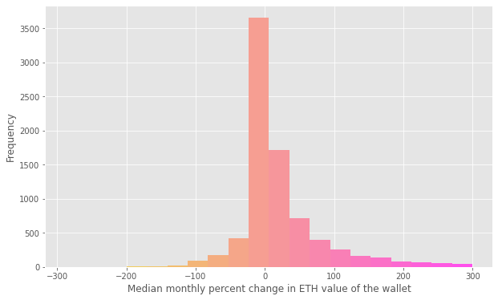

# Categories of ALCX Users

<a href='#i1'>1. Introduction</a><br>
<a href='#i2'>2. Attitude towards Ethereum</a><br> 
<a href='#i3'>3. Trading behavior</a><br>
<a href='#i4'>4. Wallet age</a><br>
&emsp;<a href='#i41'>4.1. ALCX holders' gateway tokens</a><br>
<a href='#i5'>5. Features overview</a><br>
<a href='#i6'>6. Clustering</a><br>
<a href='#i7'>7. Interpreting the clusters as behavioral categories</a><br>


<a id='i1'></a>
## 1. Introduction

Are there different categories of ALCX users and if so what are the defining characteristics of each group? To answer this question, I use data provided by Flipside and some third party data. Afte engineering a number of different features, I run a clustering algorithm and analyze the cluster to interprete the difference between each cluster of ALCX holders.

<a id='i2'></a>
## 2. Attitude towards Ethereum

The first feature is user's attitude towards Ethereum. Do they tend to transform their gain to increase their ETH holdings (ETH maximalists) or do they only use Ethereum to purchase other tokens (minimalists)? To answer that I look at the monthly variations of ETH amount in users' wallets since July 2020. The idea is to see what users tally up more positive variations over the period. Because I only cover a subperiod, some wallets may have irrealistic downward variations, such as -300%. This simply means that users had ETH in their wallet before July 2020 and have only spent it since then - while the figure is unrealistic it nonetheless reflects a "minimalist" behavior. The histogram of the median monthly variation rates is given below:

<div align="center">
  
</div>

Most of the rates are concentrated slightly above 0 and the median is at 3%. Most users' wallets have seen their ETH amount grow over the period and the maximalist to minimalist ratio is 2:1.

<a id='i3'></a>
## 3. Trading behavior

I use <a href="https://docs.flipsidecrypto.com/our-data/data-models/labels">Flipside's labels</a> to look at the trading habits and behavior of ALCX users. Labels allow us to see where the transaction of a wallet are going or coming from.

Flipside currently offers the following labels:
```
1. cex (Centralized Exchange)
2. dex (Decenralized Exchange)
3. operator (Chain Operations)
4. chadmin (Chain Adminsitration)
5. defi (Decentralized Finance Applications)
6. nft (NonFungible Token Contracts & Applications)
7. layer2 (Layer 2 Dapps)
8. dapp (Decentralized Applications)
9. token (Token Contracts)
10. flotsam (Junk or Other)
```

Looking at aggregated data, most of the transactions executed by ALCX holders are with decentralized exchanges and token contracts. Centralized exchanges are a distant third with 2 orders of magnitude less transactions. The charts of the total amount of transactions for each label are given below in a regular and logarithmic scale:


<div>
  
  
</div>

<a id='i4'></a>
## 4. Wallet age

Next, I look at wallet's age by retrieving the time stamp of its first transaction. The numbers of wallet by creation date is given in the two charts below by month and by year:

<div>
  
</div>

<div>
  
</div>

The variations follow those of the market, with a peak in 2017 that starts decreasing in 2018 and slumps throughout 2019. There is a new, much higher peak corresponding to Summer 2020's altseason, followed by another one in late 2020 to early 2021. Most of the wallets were created in the last four months. This does not necessarily map to the amount of time ALCX users have actually been in crypto, as several wallets seem to have been created specifically for the purpose of holding ALCX.


<a id='i41'></a>
## 4. 4.1. ALCX holders' gateway tokens

While this will not be used as a feature in the eventual analysis, I also parsed the wallets' first transaction to find out what was their "gateway" token to cryptocurrencies. I give the pie chart of the 20 most popular gateway tokens below. ALCX is the gateway token for many of these wallets. Since it is unlikely that ALCX would be the first purchase of somebody new to crypto, it is more reasonable to surmise that these wallets were created only for the purpose of holding ALCX. ALCX is followed by three stablecoins and a number of DeFi tokens.

<div>
  
</div>


<a id='i5'></a>
## 5. Features overview

In addition to the previously introduced features, I reused features analyzed in previous pieces, such as users' positions in Alchemix pools, early vs late holders of ALCX. I also added the volume of transactions generated by each wallets. I removed some unused features ('layer2' in labels) and looked at the correlation coefficients of the features to remove highly correlated features. The heatmap of correlations is given below:


<div>
  
</div>

The map highlights some interesting relationship such as the positive correlation between the amount of funds in the Vault, the propensity to use DeFi solutions and the volume of trading. Late holders of ALCX have a negative correlation with a number of features, but that is likely to be merely due to the recent age of the wallets.


<a id='i6'></a>
## 6. Clustering

After some cleaning and preprocessing (encoding of categorical variables, normalization), the data is ready to be used for clustering. To determine the optimal number of cluster I use the heuristic <a href="https://en.wikipedia.org/wiki/Elbow_method_(clustering)">elbow method</a>, plotting the explained variation for different numbers of clusters. I take 9 as the number of clusters.


<div>
  
</div>

I use t-SNE to plot a 3D representation of the data points (the wallets) in our dataset. We notice a fairly reasonable segmentation and a large variability in the size of clusters:


<div>
  
</div>


<a id='i7'></a>
## 7. Interpreting the clusters as behavioral categories

Clustering tells us that we have different group of users, but so far it does not tell us how these groups differ. To interprete them I will use a simple machine learning method. I train a classifier to classify users into each of the clusters. Once the training is done, we can look at the features used by the classifier and their weight in the classification decision to understand how the model came to its conclusion. Doing so can tell us what are the differentiating criterias between the clusters.

I start by training a Random Forest classifier on the dataset. The results are excellent across all classes (clusters) adding up to an overall F-1 score of 94%. This is a good sign that the clusters are easily distinguishable. 

The importance given by the classifier to each feature in our dataset is given in the chart below:

<div>
  
</div>

Features such as the age of the wallet or whether the user is an early or old holder of ALCX did not prove to be very meaningful. On the other hand, the types and volume of transactions as well as the amount of funds locked in Alchemix pools prove to important features.

To better see how these features map to our clusters, I plot the per-class importance of the 10 most important features:

<div>
  
</div>

This, in turn, allow us to describe the clusters as meaningful categories. For instance Cluster 0 is a group of users who make use the Alchemix Vault and DeFi solutions. Cluster 1 are users who display minimal engagement with Alchemix or DeFi and a low trading volume. Cluster 2 are NFT enthusiasts. Cluster 3 are users who do not provide liquidity on Sushi. Cluster 4 are users who are less likely to trade and engage with DeFi protocols. Cluster 5 are users who lock a lot of liquidity in the CRValUSD pool. Cluster 6 is very similar to Cluster 1 and could be merged with it. Cluster 7 are traders with high transaction volume, high activity on DEXes and perform a lot of token trading. Cluster 8 are users who do not stake their ALCX in the single asset pool. 
